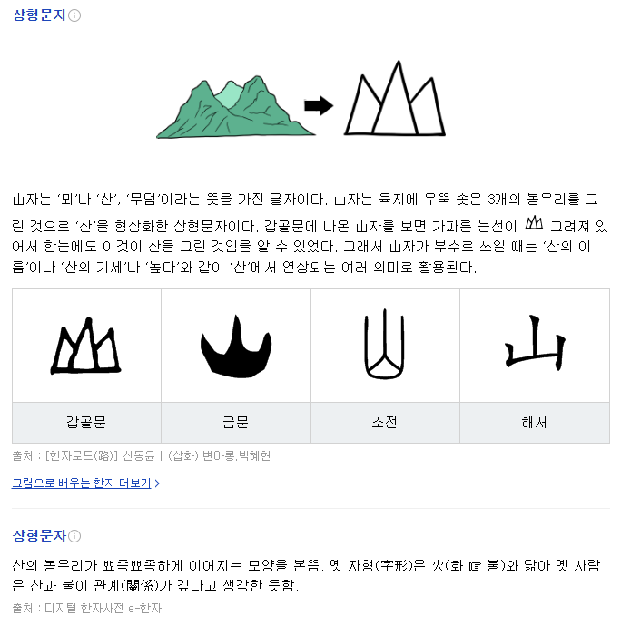
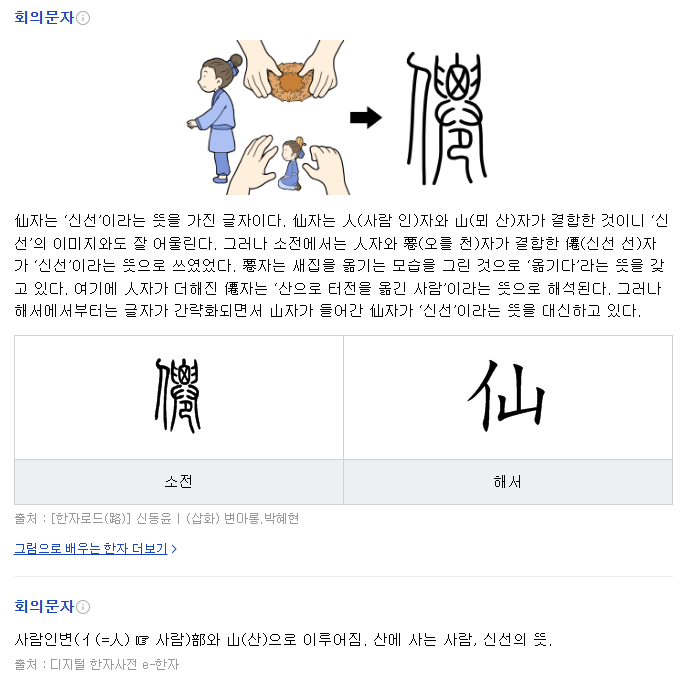
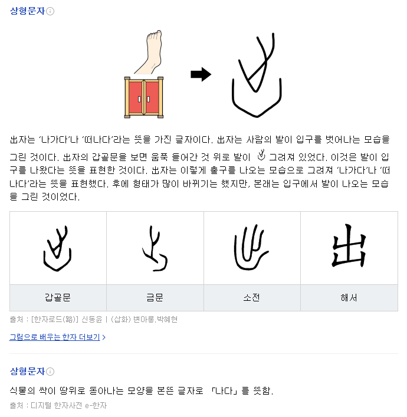
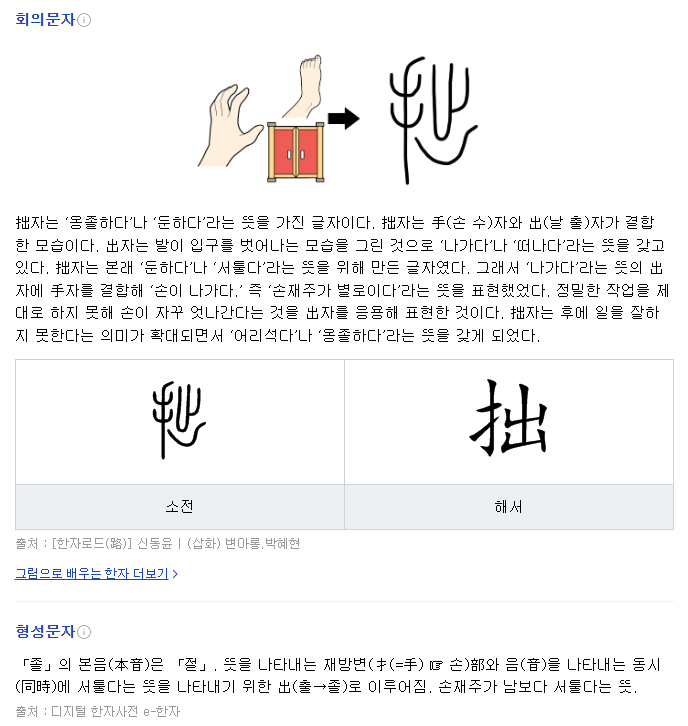
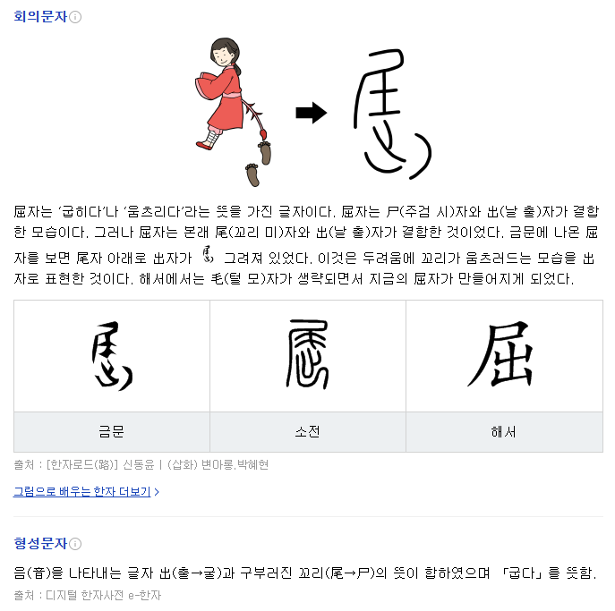

## 1권 불어라! 바람 풍 風

### [메 산 山](https://hanja.dict.naver.com/#/entry/ccko/519529b035fb4815add9f3c1a0c45280)

### [신선 선 仙](https://hanja.dict.naver.com/#/entry/ccko/6622dfecac454e378b4b5f9ce42e0f1a)

### [날 출, 단락 척 出](https://hanja.dict.naver.com/#/entry/ccko/aa0caaf56a324da582b7d4e85f0d989f)

### [옹졸할 졸 拙](https://hanja.dict.naver.com/#/entry/ccko/136e328d1b384e958ba54bdd6b51d36c)

### [굽힐 굴, 옷 이름 궐 屈](https://hanja.dict.naver.com/#/entry/ccko/917e678cf1a64cf291b9156632b41a8a)

